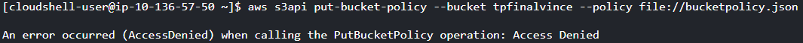

# Modélisation

Afin de réaliser notre projet de manière efficace, nous avons tout d'abord mis au point cette modélisation qui nous permet d'obtenir une vue d'ensemble de l'architecture à établir :


_En cas de difficulté, vous pouvez ouvrir les fichiers images directement, celles-ci sont présentes dans le répertoire._

# Ma configuration AWS 
## A titre informatif :
J'ai rassemblé diverses informations en-dessous afin de m'aider lors des différentes commandes à effectuer.
## VPCs
| VPC Name | CIDR Block   | VPC ID               |
|----------|--------------|----------------------|
| VPC 1    | 10.0.0.0/16  | vpc-02c53e8991377c7e7|
| VPC 2    | 10.1.0.0/16  | vpc-047a530c9bf8125ca|
| VPC 3    | 10.2.0.0/16  | vpc-0e75708eeed5e3458|

## Subnets
| Subnet Name | CIDR Block   | Subnet ID            |
|-------------|--------------|----------------------|
| SUBNET 1    | 10.0.1.0/24  | subnet-00854d03dad056864|
| SUBNET 2    | 10.1.1.0/24  | subnet-0dec1e62bb81e3de1|
| SUBNET 3    | 10.2.1.0/24  | subnet-0bcb927cbda4a8f0f|

## Internet Gateway
| Resource           | InternetGateway ID  |
|--------------------|---------------------|
| Internet Gateway   | igw-08c1d7d1ada1bdf05|

## Route Tables
| Route Table Name | Route Table ID       |
|------------------|----------------------|
| RTB 1            | rtb-05258ecdb0511cba4|
| RTB 2            | rtb-0dbd1e866891b0631|
| RTB 3            | rtb-0151c08441d09941a|

## Route Table Associations
| Association Name  | Association ID        |
|-------------------|-----------------------|
| RTB Assoc 1       | rtbassoc-034c284268be787ff|
| RTB Assoc 2       | rtbassoc-055555f14342ead2c|
| RTB Assoc 3       | rtbassoc-0986f81ff8788364d|


# Création des VPC

Nous créons nos 3 VPC, en faisant attention à nos block CIDR afin d'éviter tout chevauchement lors du futur peering. On leur donne également un tag.
```
aws ec2 create-vpc --cidr-block 10.0.0.0/16 --query Vpc.VpcId --output text
aws ec2 create-tags --resources vpc-02c53e8991377c7e7 --tags Key=Name,Value=VPC1-cacciatore
```
```
aws ec2 create-vpc --cidr-block 10.1.0.0/16 --query Vpc.VpcId --output text
aws ec2 create-tags --resources vpc-047a530c9bf8125ca --tags Key=Name,Value=VPC2-cacciatore
```
```
aws ec2 create-vpc --cidr-block 10.2.0.0/16 --query Vpc.VpcId --output text
aws ec2 create-tags --resources vpc-0e75708eeed5e3458 --tags Key=Name,Value=VPC3-cacciatore
```

# Création des subnets
On crée un subnet pour chaque VPC, toujours avec un block CIDR correspondant, en indiquant la zone de disponibilité.
```
aws ec2 create-subnet --vpc-id vpc-02c53e8991377c7e7 --cidr-block 10.0.1.0/24 --availability-zone us-east-1a --query Subnet.SubnetId --output text

aws ec2 create-tags --resources subnet-00854d03dad056864 --tags Key=Name,Value=public-subnet-1
```
```
aws ec2 create-subnet --vpc-id vpc-047a530c9bf8125ca --cidr-block 10.1.1.0/24 --availability-zone us-east-1a --query Subnet.SubnetId --output text

aws ec2 create-tags --resources subnet-0dec1e62bb81e3de1 --tags Key=Name,Value=private-subnet-2
```
```
aws ec2 create-subnet --vpc-id vpc-0e75708eeed5e3458 --cidr-block 10.2.1.0/24 --availability-zone us-east-1a --query Subnet.SubnetId --output text

aws ec2 create-tags --resources subnet-0bcb927cbda4a8f0f --tags Key=Name,Value=private-subnet-3
```
# Création de la gateway internet
L'instance présente dans notre premier VPC doit pouvoir être accessible via Internet (sur certaines ports). Ainsi, il faut créer une gateway internet.
```
aws ec2 create-internet-gateway --query InternetGateway.InternetGatewayId --output text

aws ec2 create-tags --resources igw-08c1d7d1ada1bdf05 --tags Key=Name,Value=internetgateway1
```
# Attachement de la gateway internet au premier VPC
Une fois créée, la gateway doit être attaché à notre vpc.
```
aws ec2 attach-internet-gateway --vpc-id vpc-02c53e8991377c7e7 --internet-gateway-id igw-08c1d7d1ada1bdf05
```
# Création des tables de routages
Pour chaque VPC, on crée une table de routage.
```
aws ec2 create-route-table --vpc-id vpc-02c53e8991377c7e7 --query RouteTable.RouteTableId --output text

aws ec2 create-tags --resources rtb-05258ecdb0511cba4 --tags Key=Name,Value=routable-cli-1
```
```
aws ec2 create-route-table --vpc-id vpc-047a530c9bf8125ca --query RouteTable.RouteTableId --output text

aws ec2 create-tags --resources rtb-0dbd1e866891b0631 --tags Key=Name,Value=routable-cli-2
```
```
aws ec2 create-route-table --vpc-id vpc-0e75708eeed5e3458 --query RouteTable.RouteTableId --output text

aws ec2 create-tags --resources rtb-0151c08441d09941a --tags Key=Name,Value=routable-cli-3
```


# On crée la route pour l'internet gateway
Dans la table de routage de notre premier VPC, on crée une nouvelle route qui dirige tout le trafic sortant du VPC vers Internet via notre gateway précédement créée. 
```
aws ec2 create-route --route-table-id rtb-05258ecdb0511cba4 --destination-cidr-block 0.0.0.0/0 --gateway-id igw-08c1d7d1ada1bdf05
```


# Association des tables de routages
On associe chaque table de routage à nos subnets respectifs.
```
aws ec2 associate-route-table --route-table-id rtb-05258ecdb0511cba4 --subnet-id subnet-00854d03dad056864
```
```
aws ec2 associate-route-table --route-table-id rtb-0dbd1e866891b0631 --subnet-id subnet-0dec1e62bb81e3de1
```
```
aws ec2 associate-route-table --route-table-id rtb-0151c08441d09941a --subnet-id subnet-0bcb927cbda4a8f0f
```


# Création des demandes de peerings entre VPC
### De VPC 1 à VPC 2 :
```
aws ec2 create-vpc-peering-connection --vpc-id vpc-02c53e8991377c7e7 --peer-vpc-id vpc-047a530c9bf8125ca
```
### De VPC 1 à VPC 3 :
```
aws ec2 create-vpc-peering-connection --vpc-id vpc-02c53e8991377c7e7 --peer-vpc-id vpc-0e75708eeed5e3458
```
### De VPC 2 à VPC 3 :
```
aws ec2 create-vpc-peering-connection --vpc-id vpc-047a530c9bf8125ca --peer-vpc-id vpc-0e75708eeed5e3458
```
# Acceptation des demandes de peerings
### De VPC 1 à VPC 2 :
```
aws ec2 accept-vpc-peering-connection --vpc-peering-connection-id pcx-0bc30431a413aa891
```
### De VPC 1 à VPC 3 :
```
aws ec2 accept-vpc-peering-connection --vpc-peering-connection-id pcx-066257c4209d8f9c7
```
### De VPC 2 à VPC 3 :
```
aws ec2 accept-vpc-peering-connection --vpc-peering-connection-id pcx-0678ab7b6e07237e0
```

# Mise à jour des tables de routages
Chaque VPC (subnet en réalité) doit faire référence aux 2 autres :
### VPC 1
```
aws ec2 create-route --route-table-id rtb-05258ecdb0511cba4 --destination-cidr-block 10.1.0.0/16 --vpc-peering-connection-id pcx-0bc30431a413aa891

aws ec2 create-route --route-table-id rtb-05258ecdb0511cba4 --destination-cidr-block 10.2.0.0/16 --vpc-peering-connection-id pcx-066257c4209d8f9c7
```
### VPC 2
```
aws ec2 create-route --route-table-id rtb-0dbd1e866891b0631 --destination-cidr-block 10.0.0.0/16 --vpc-peering-connection-id pcx-0bc30431a413aa891

aws ec2 create-route --route-table-id rtb-0dbd1e866891b0631 --destination-cidr-block 10.2.0.0/16 --vpc-peering-connection-id pcx-0678ab7b6e07237e0
```
### VPC 3
```
aws ec2 create-route --route-table-id rtb-0151c08441d09941a --destination-cidr-block 10.0.0.0/16 --vpc-peering-connection-id pcx-066257c4209d8f9c7

aws ec2 create-route --route-table-id rtb-0151c08441d09941a --destination-cidr-block 10.1.0.0/16 --vpc-peering-connection-id pcx-0678ab7b6e07237e0
```
# Création des groupes de sécurité
On crée un groupe de sécurité par VPC.
```
aws ec2 create-security-group --group-name groupesecu1 --description "Groupe de securite 1" --vpc-id vpc-02c53e8991377c7e7
```
```
aws ec2 create-security-group --group-name groupesecu2 --description "Groupe de securite 2" --vpc-id vpc-047a530c9bf8125ca
```
```
aws ec2 create-security-group --group-name groupesecu3 --description "Groupe de securite 3" --vpc-id vpc-0e75708eeed5e3458
```
Enfin, on va autoriser la communication sur les ports 22 et 80.
## Autorisation du port 22 (SSH)
```
aws ec2 authorize-security-group-ingress --group-id sg-0c77348ab6e0ad693 --protocol tcp --port 22 --cidr 0.0.0.0/0
```
```
aws ec2 authorize-security-group-ingress --group-id sg-03152b1f97137b63b --protocol tcp --port 22 --cidr 0.0.0.0/0
```
```
aws ec2 authorize-security-group-ingress --group-id sg-0e76b4efe7b597dc9 --protocol tcp --port 22 --cidr 0.0.0.0/0
```
## Autorisation du port 80 (HTTP)
```
aws ec2 authorize-security-group-ingress --group-id sg-0c77348ab6e0ad693 --protocol tcp --port 80 --cidr 0.0.0.0/0
```
```
aws ec2 authorize-security-group-ingress --group-id sg-03152b1f97137b63b --protocol tcp --port 80 --cidr 0.0.0.0/0
```
```
aws ec2 authorize-security-group-ingress --group-id sg-0e76b4efe7b597dc9 --protocol tcp --port 80 --cidr 0.0.0.0/0
```
# Création et lancement des 3 instances
On crée et lance nos 3 instances. 
On fait attention de choisir la bonne image, ici, Debian. On attribue nos groupes de sécurité respectifs, on attribue une IP publique à notre instance présente dans le VPC1 seulement.

```
aws ec2 run-instances --image-id ami-058bd2d568351da34 --count 1 --instance-type t2.micro --key-name mysshprivatekey --security-group-ids sg-0c77348ab6e0ad693 --subnet-id subnet-00854d03dad056864 --associate-public-ip-address
```
```
aws ec2 run-instances --image-id ami-058bd2d568351da34 --count 1 --instance-type t2.micro --key-name mysshprivatekey --security-group-ids sg-03152b1f97137b63b --subnet-id subnet-0dec1e62bb81e3de1 --no-associate-public-ip-address
```
```
aws ec2 run-instances --image-id ami-058bd2d568351da34 --count 1 --instance-type t2.micro --key-name mysshprivatekey --security-group-ids sg-0e76b4efe7b597dc9 --subnet-id subnet-0bcb927cbda4a8f0f --no-associate-public-ip-address
```

# Connexions SSH

On test tout d'abord de nous connecter en SSH à l'instance du vpc1, via son adresse IP publique : 
```
ssh -i "mysshprivatekey.pem" admin@44.197.189.87
```


Nous y avons bien accès.

## Rebonds

Depuis notre machine, via cette commande, nous allons nous connecter à le première instance, via Internet, et depuis celle-ci nous allons aller sur l'instance du vpc 2, via son ip privé :
```
ssh -o ProxyCommand="ssh -W %h:%p -i mysshprivatekey.pem admin@44.197.189.87 " -i mysshprivatekey.pem admin@10.2.1.61
```


Nous y avons bien accès.


## NGINX
Sur l'instance présente dans notre VPC 1, on met à jour la liste des paquets disponibles et on installe leurs dernières versions puis on installe, active et lance nginx :
```
sudo apt update && sudo apt upgrade -y

sudo apt install nginx -y

sudo systemctl enable nginx

sudo systemctl start nginx
```

En se rendant sur notre serveur (ip public), on voit bien :


# Bucket

Dans CloudShell, on crée un bucket : 
```
aws s3 mb s3://tpfinalvince
```
On le configure pour qu'il héberge un site web :
```
aws s3 website s3://tpfinalvince/ --index-document index.html --error-document error.html
```
Il faut ensuite appliquer une politique bucket pour autoriser l'accès public :

Je crée un fichier .json avec cette politique : 


J'execute celle -ci :
```
aws s3api put-bucket-policy --bucket tpfinalvince --policy file://bucketpolicy.json
```


J'obtiens malheureusement un Access Denied.


J'ai alors essayé une autre solution qui permet de gérer les ACL :
```

aws s3api put-public-access-block \
--bucket tpfinalvince \
--public-access-block-configuration "BlockPublicAcls=false,IgnorePublicAcls=false,BlockPublicPolicy=false,RestrictPublicBuckets=false"
```
Après cela, j'ai créé un fichier de politique pour accorder la lecture à tout le monde : 


J'ai exécuté cette commande : 
```
aws s3api put-bucket-policy --bucket tpfinalvince --policy file://public-read-policy.json
```
Sur le portail AWS, on observe bien que c'est passé en public : 


et on retrouve bien mon .json : 


En revanche, j'ai décidé de directement upload les fichiers comme montré en cours, via l'interface graphique, une fois cela fait, je vérifie :
```
aws s3 ls s3://tpfinalvince/
```


On a bien accès à notre site web :


## NGINX

De retour sur notre instance présente dans le VPC1, on se rend ici : /var/www/html/

On modifie le .html de base présent dans nginx, et on ajoute le lien de notre image présent dans notre bucket : 


Il faut faire la commande ```sudo su``` pour avoir les droits de modifications.


Ainsi, au travers du lien écrit dans le .html, on obtient bien, via notre instance comprenant nginx, une image qui est stockée dans notre bucket :


# Conclusion
Ce projet a permis de mettre en oeuvre tout ce qu'on avait pu voir lors des différents cours/TP. Ce projet nous a aussi permis de réellement pratiquer en CloudShell, avec les différentes commandes que notre projet impliquaient. Néanmoins, il reste énormement de services et d'éléments à découvrir/étudier au sein d'AWS !